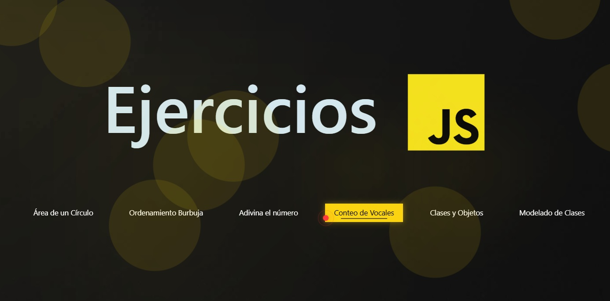
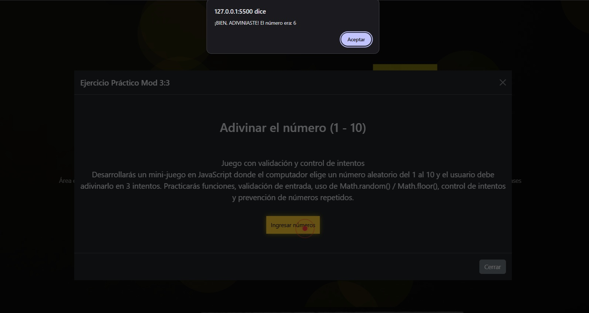
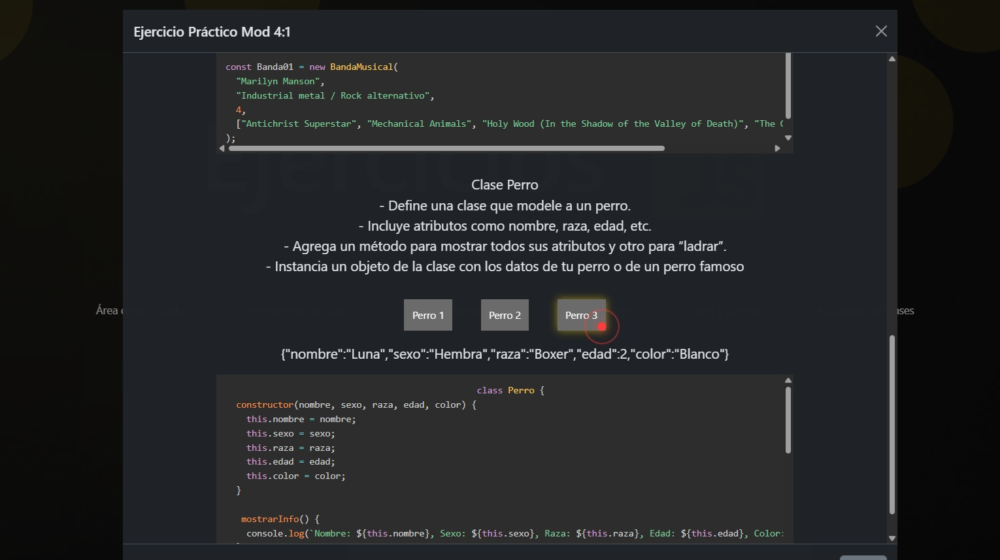

<h1 align="center">⚙️ Ejercicios JavaScript</h1>

Este sitio lo desarrollé con HTML / CSS / JavaScript e integra diferentes modulos de aprendizaje con actividades resueltas, algunos con vista del código para una mayor comprensión.   

Para el diseño básico y de modals, usé Bootstrap, también agregué funciones de JavaScript para una interacción llamativa con elementos canvas que interactúan con eventos del mouse, estas funciones puedes encontraarlas en <b>bolitas.js</b>

  

Iré actualizando con más detalles pronto 

  

  
  

